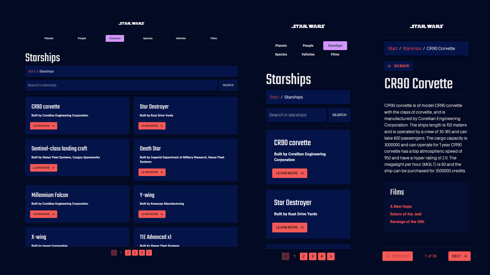

# Star Wars Info App

This assignment was part of our advanced React course, where the challenge was to develop an application that offers comprehensive information about the Star Wars universe. The app fetches data from an API and presents it in a visually appealing manner. An essential requirement was to incorporate query parameters and implement search functionality for each category, as well as pagination.

## The solution

Visit my solution here:

**⭐ Solution URL:** [https://swapi-mi-app.netlify.app/](https://swapi-mi-app.netlify.app/)

## Built with

- [React](https://reactjs.org/) - JS library
- [Material UI](https://mui.com/) - Component library
- [Vite](https://vitejs.dev/) - Frontend tooling
- [Netlify](https://www.netlify.com/) - Deployment

## Screenshots

